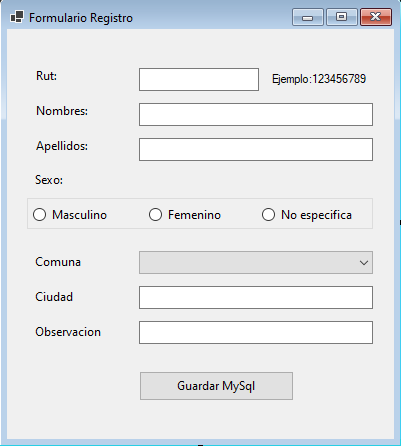

# Formulario de Registro de Personas

 [](https://github.com/Jonaaxsic)
## Descripción

Esta aplicación de escritorio desarrollada en **Visual Basic .NET** **De caracter Educativo**. Permite el ingreso y almacenamiento de datos básicos de personal en una base de datos **MySQL**. El formulario está diseñado para ser simple, intuitivo y seguro, validando los campos obligatorios antes de guardar la información.

## Características

- Ingreso de datos personales: Rut, Nombres, Apellidos, Sexo, Comuna, Ciudad y Observación.
- Validación de campos obligatorios y selección de sexo.
- ComboBox con todas las comunas de la Región Metropolitana de Santiago.
- Almacenamiento seguro de los datos en una tabla MySQL.
- Interfaz gráfica fija, no redimensionable, y centrada en pantalla.
- Mensajes de éxito y error para el usuario.
- Limpieza automática del formulario tras guardar.

## Captura de pantalla



## Requisitos

- Visual Studio 2022 o superior
- .NET Framework 4.7.2 o superior
- MySQL Server
- Conector MySQL para .NET (`MySql.Data`)

## Instalación y uso

1. Clona este repositorio o descarga el código fuente.
2. Abre el proyecto en Visual Studio.
3. Asegúrate de tener instalado el paquete NuGet `MySql.Data`.
4. Configura tu base de datos MySQL y crea la tabla con la siguiente estructura:

    ```sql
    CREATE DATABASE IF NOT EXISTS registropersonas;
    USE registropersonas;

    CREATE TABLE IF NOT EXISTS Personas (
        RUT VARCHAR(20) PRIMARY KEY,
        Nombre VARCHAR(100),
        Apellido VARCHAR(100),
        Sexo VARCHAR(20),
        Comuna VARCHAR(100),
        Ciudad VARCHAR(100),
        Observacion VARCHAR(255)
    );
    ```

5. Ajusta la cadena de conexión en `Form1.vb` si es necesario.
6. Ejecuta la aplicación desde Visual Studio.


## Licencia

Este proyecto se distribuye bajo la licencia MIT.
